# 릴리스별 모습

메뉴바 항목이 버전마다 어떻게 바뀌었는지 그림으로 남긴다. 고르는 기준이 대부분 "어느
쪽이 눈에 잘 들어오는가" 였기 때문에, 바뀐 내용을 글로만 적어두면 나중에 되짚을 수가 없다.

여기 있는 PNG 는 설명을 위해 다시 그린 그림이 아니다. **해당 태그의 아이콘 소스를 그대로
꺼내 컴파일해 그린 것**이라, 그 버전을 설치하면 실제로 저렇게 보인다.

```sh
scripts/render-icon.sh v0.9.0 /tmp/out.png   # 한 버전
scripts/snapshot-releases.sh --all           # 전부 다시
```

## 그림 읽는 법

가로 4칸은 같은 상황을 버전마다 똑같이 놓은 것이다. 버전끼리 나란히 놓고 비교하려면
조건이 같아야 한다.

| 칸 | 상태 | 세션 / 주간 사용률 |
| --- | --- | --- |
| 1 | 여유 | 29% / 20% |
| 2 | 주의 | 68% / 55% |
| 3 | 임박 | 94% / 88% |
| 4 | 소진 | 100% / 96% |

세로 3줄은 배경이다. 메뉴바는 반투명이라 배경화면 색이 그대로 비친다. 밝기만 보면
놓치는 것이 있어 **색이 있는 배경(파랑)** 을 맨 위에 둔다. 아래 두 줄은 어두운 배경과
밝은 배경이다.

v0.5.1 까지는 아이콘 옆에 사용률 숫자가 제목으로 붙어 있었다. 그때 메뉴바에 보이던 것이
아이콘만이 아니므로 숫자까지 같이 그렸다.

## 원하는 버전 설치하기

tap 에 들어 있는 스크립트를 쓴다.

```sh
brew tap kube-guy/kit
"$(brew --repo kube-guy/kit)"/install-version.sh ai-usage-bar 0.7.2
```

설치한 버전에 머무르도록 `brew pin` 까지 걸어둔다. 걸어두지 않으면 다음 `brew upgrade`
에서 조용히 최신으로 올라간다. 최신으로 돌아갈 때는 이렇게 한다.

```sh
"$(brew --repo kube-guy/kit)"/install-version.sh ai-usage-bar latest
```

스크립트가 하는 일은 formula 파일을 그 버전의 커밋으로 잠깐 되돌려 설치하고 파일을
원래대로 돌려놓는 것뿐이다. 직접 하려면 이렇게 된다.

```sh
tap="$(brew --repo kube-guy/kit)"
git -C "$tap" log --oneline -- Formula/ai-usage-bar.rb   # 버전별 커밋 찾기
git -C "$tap" checkout <커밋> -- Formula/ai-usage-bar.rb
brew reinstall ai-usage-bar && brew pin ai-usage-bar
git -C "$tap" checkout HEAD -- Formula/ai-usage-bar.rb   # 되돌리기
brew services restart ai-usage-bar
```

---

## v0.9.0 — 원 속을 짙은 네이비로 채운다

배경화면이 파랗면 링과 글자가 같은 파랑 위에 놓여 C/X 가 묻혔다. 원 속을 `#174F73` 으로
채워 글자가 늘 같은 바탕 위에 오게 했다. 원 안은 배경과 무관하게 항상 어두우므로 링과
글자는 명암을 따라가지 않고 흰 계열로 고정한다.

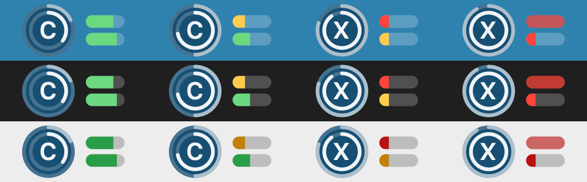

## v0.8.2 — 다 썼을 때 막대를 빨갛게

남은 양을 칠하는 방식이라 0% 가 되면 칠할 것이 없어, 가장 위험한 순간에 신호가 사라졌다.
그때는 빈 트랙 자체를 빨갛게 둔다(4번 칸).

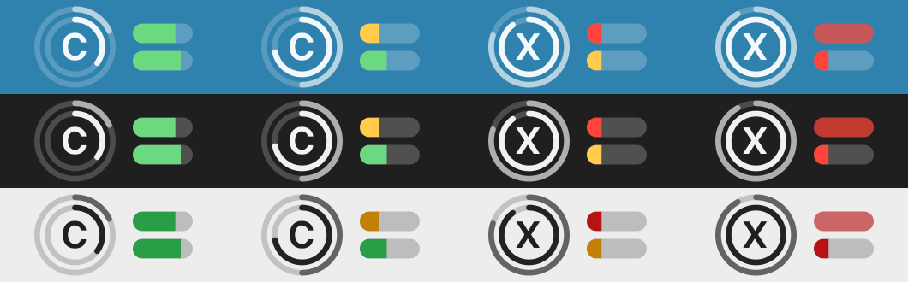

## v0.8.1 — 메뉴 색을 진하게

메뉴 안의 색만 바꿨다. 아이콘은 v0.8.0 과 같다.

## v0.8.0 — 메뉴의 한도 표시에 색을 넣는다

메뉴를 펼쳤을 때 보이는 막대와 글자에 색을 넣었다. 아이콘은 v0.7.2 와 같다.

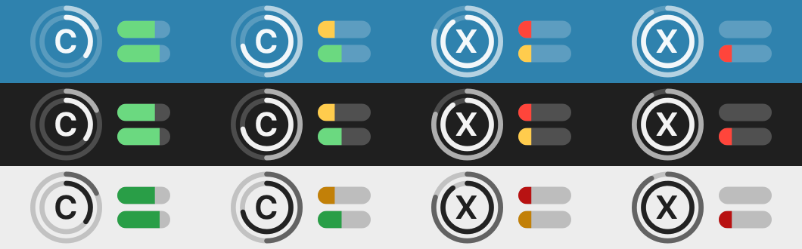

## v0.7.2 — 잔량이 아주 적을 때도 막대가 보이게

2% 남았을 때 폭이 0.28pt 라 사실상 사라졌다. 최소 폭을 두어 가장 위험할 때 신호가
없어지지 않게 했다.


## v0.7.1 — 막대를 다시 잔여량으로

v0.7.0 에서 사용량으로 채우게 바꿨던 것을 되돌렸다. 배터리처럼 쓸수록 줄어드는 쪽이 맞다.

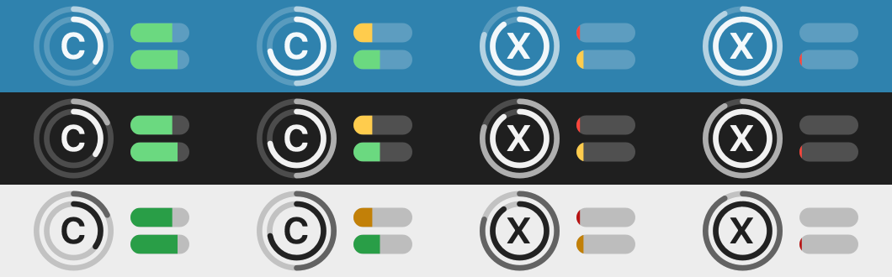

## v0.7.0 — 막대를 쓴 만큼 채운다

메뉴에 적힌 값과 방향을 맞추려 한 시도. 잔여량과 반대라 v0.7.1 에서 되돌렸다.

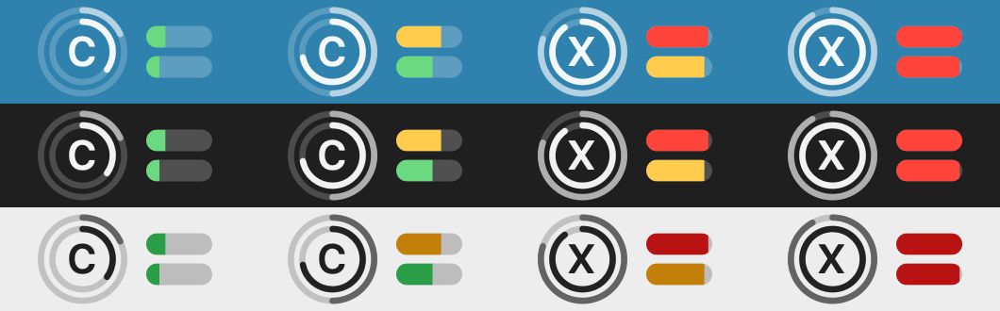

## v0.6.3 — 막대 채움 비율을 실제와 맞춘다

둥근 캡슐로 채우면 눈이 둥근 끝을 뺀 몸통을 비교해, 53% 가 30% 처럼 보였다. 트랙 모양으로
잘라내고 사각형을 채우도록 바꿨다.

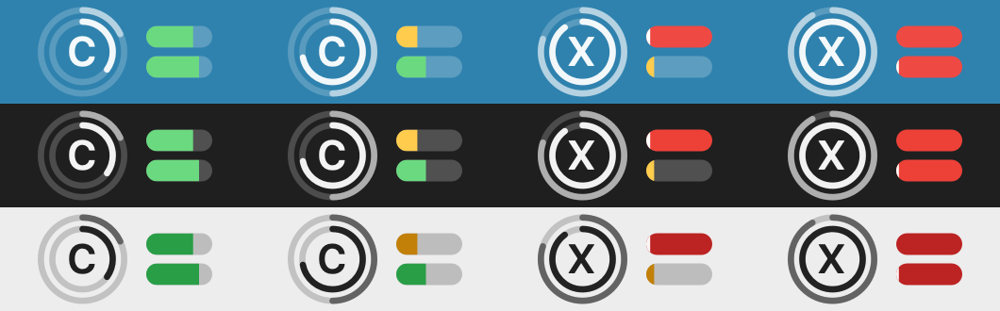

## v0.6.2 — 잔량이 얼마 없으면 막대 전체를 빨갛게

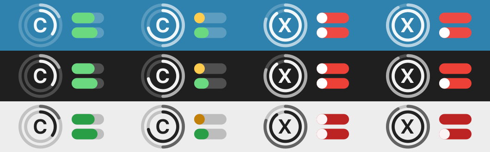

## v0.6.1 — 글자를 원 안으로

v0.6.0 은 글자가 원 밖에 붙어 있었다. 선을 얇게 해 자리를 만들고 글자를 원 안에 넣었다.
빨강도 진하게 했다.

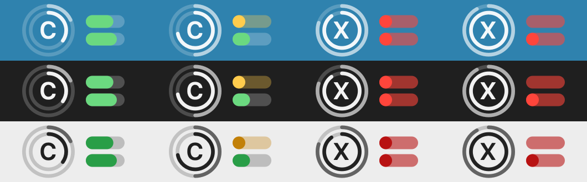

## v0.6.0 — 숫자 없이 그림만으로 다시 설계

숫자를 빼고, 원 두 개(안쪽 5시간·바깥 주간 리셋까지의 경과)와 가로 막대 두 개(위 5시간·
아래 주간 잔여 한도)로 나눴다. 시간은 돌아오니 원, 한도는 쓰면 줄어드니 막대다.
여기서부터 항목 폭이 고정되고 숫자가 사라진다.

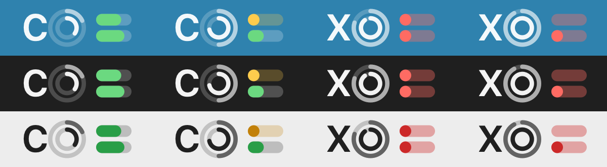

## v0.5.1 — 바깥 링을 두껍고 진하게

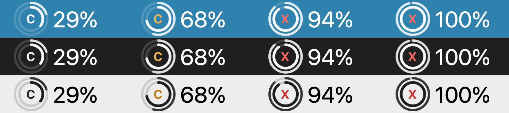

## v0.5.0 — 주간 한도를 바깥 링에

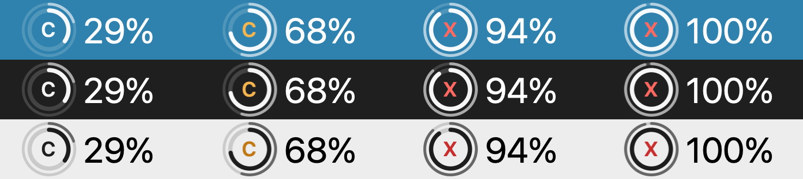

## v0.4.0 — 바깥 링을 경과 기준으로

남은 시간이 줄어드는 대신 지난 시간이 차오르게 바꿨다.

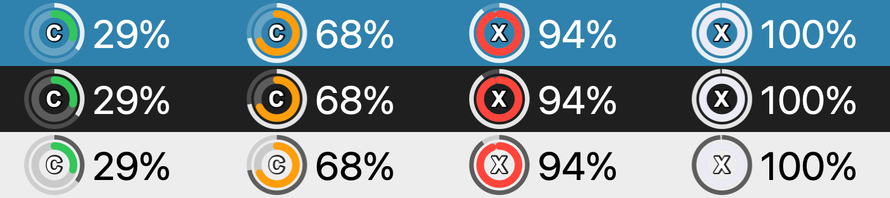

## v0.3.0 — 리셋까지 남은 시간을 바깥 링에

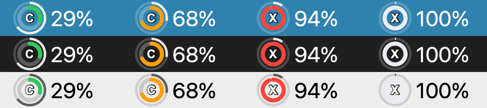

## v0.2.0 — 첫 Swift 판

링 하나에 사용률, 옆에 숫자. 파이썬 판을 Swift 로 옮긴 첫 버전이다.

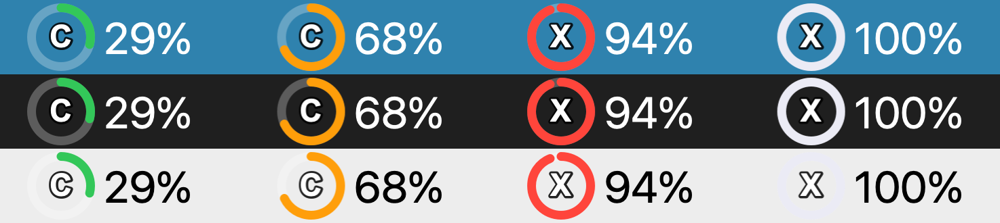
